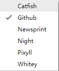
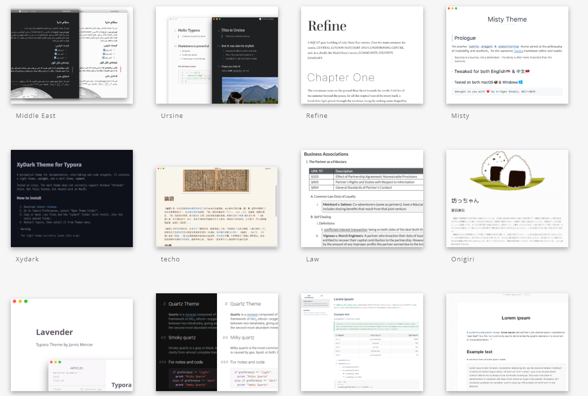
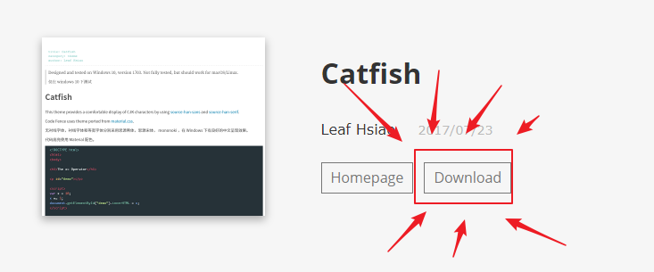
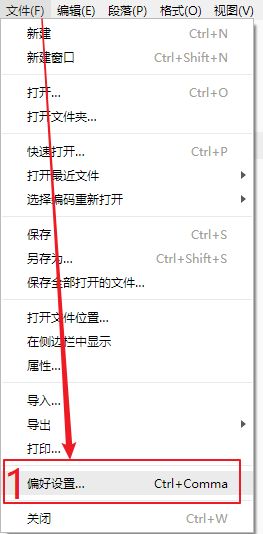
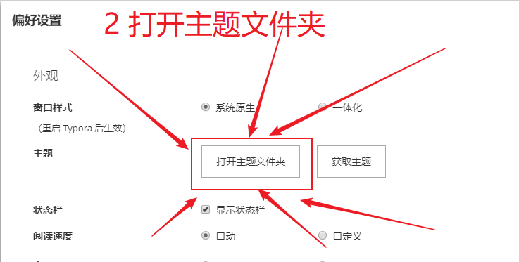
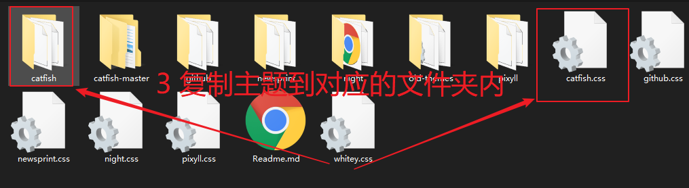
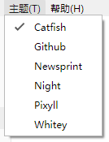
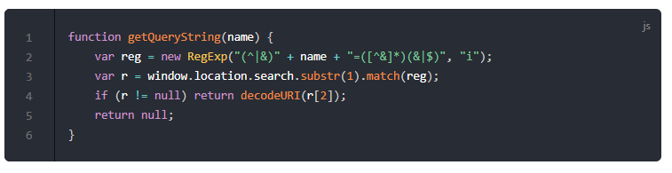
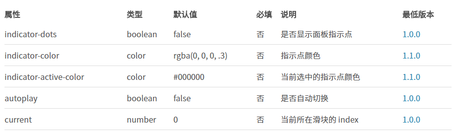
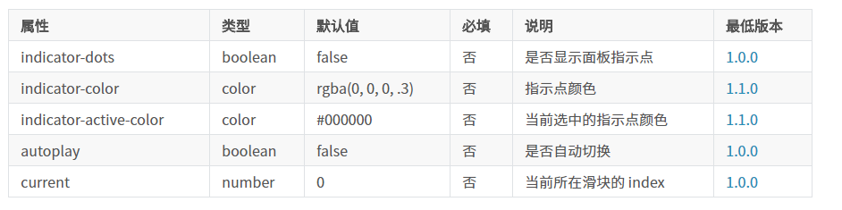

# 好看的typora主题

我们使用typora一般是使用默认的主题。我们可以直接使用内置的主题进行切换。

# 迭代
   1. 添加了代码段中选中字体的样式

## 使用typora默认主题

1. 选择**主题**菜单  进行切换。

   

   

## 安装更多主题

1. 打开网站，浏览主题 [typora网站](http://theme.typora.io/)

   

2. 选择喜欢的主题，进行下载

   

3. 把下载好的主题 克隆到  `typora`指定的文件夹

   

   

   

4. 切换主题

   

## 好看的主题

程序员的关系，喜欢的主题 必须带有黑色的代码段。而这简单需求，只有  `catfish` 主题实现了。类似这种效果。

但是，`catfish` 主题内的表格 格式 又很丑。类似

因此，对它改造了一下，名字叫做 `catfish-mmd`  么么哒。 要的话，直接下载使用即可。

# 下载地址

[地址](https://github.com/itcastWsy/typora-theme)

